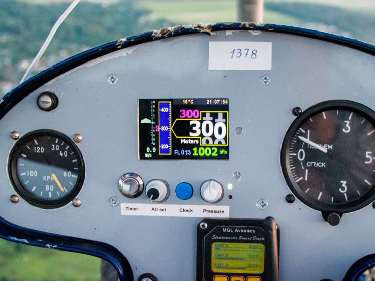

# Arduino-based altimeter

##
This is a project of an avionic device that uses the BMP085 sensor to measure atmospheric pressure and convert it to altitude in meters above or below a specified reference level. The reference level can be set using an encoder knob to enter the base atmospheric pressure, which can be measured at ground level (QFE), sea level (QNH), or the standard value of 1013 hectopascals (760 millimeters of mercury), known as QNE. The project uses standard Arduino libraries such as Wire.h and Arduino.h to communicate with the sensor and display the results on a graphics TFT screen. In the current version, the device only displays altitude in meters.
## Feature list
- Digital altitude value in meters what emulates an analog counter;
- Analog altitude value on a ruler;
- Reference pressure input via encoder knob;
- Use of hectopascals and millimeters of mercury;
- Specified altitude input via another encoder knob;
- Displays specified altitude on analog ruler and as digital value;
- Vertical speed digital value in meters per second;
- Analog value of vertical speed displays as up and down arrows on a logarithmic scale;
- Flight level: the altitude in hundreds of feets based on the standard pressure;
- Temperature;
- Real-time clock with backup battery;
- Counting timer for flight time;
- LED indicator of approaching to specific altitude;
- LED indicator of timer working;
- Reset QFE function on the ground: set the reference pressure from the current one with one click;
- Parameters storage in EEPROM.
## Hardware
- Arduino Mega 2560;
- TFT display 480x320, 16-bit color (RGB 5-6-5);
- DS3231 as RTC;
- BMP085 as pressure and temperature sensor;
- LM2596-5.0 as power supply;
- 3D-printed box, buttons and knobs.
